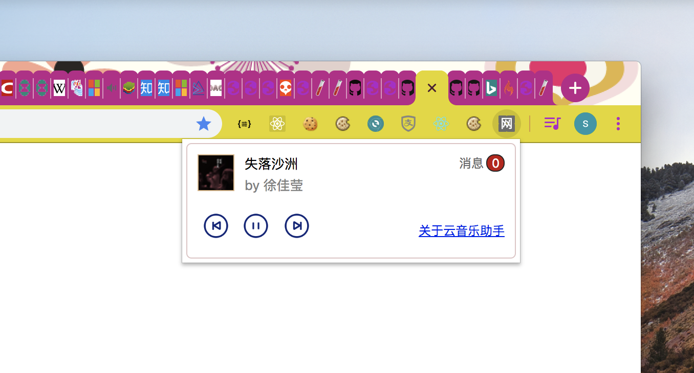
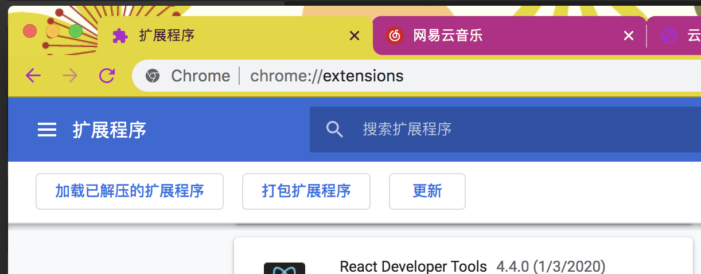

**云音乐助手**是一款Chrome浏览器插件，如果您习惯用浏览器听网易云音乐，请留步，您可能会觉得此插件很有用。

有了这个插件您不必在多个标签页之间费力地切换，通过插件即可方便地控制播放。

运行效果如下：

话不多说，开始安装。

# 手动方式安装

### 1. 下载

点击 [easelisten-v0.1.zip](./easelisten-v0.1.zip) 将插件下载到本地电脑。也可右键另存为进行保存。

### 2. 安装

在浏览器地址栏输入<code>chrome://extensions/</code>，如下图：

勾选页面右上角的“开发者模式”，以打开浏览器的开发者模式。这一步很重要。

然后把上一步下载的文件拖入此页面中（注意不要解压，保持原样），如下：

如上图，安装完成以后，浏览器的工具条栏目中将会出现“网”字图标的插件，点击一下就可以启动了。

使用过程中如遇到有问题，请点击 [https://github.com/easelisten/easelisten.github.io/issues/new](https://github.com/easelisten/easelisten.github.io/issues/new) ，在这里提出来，我将尽快为您解决。

Enjoy it!
